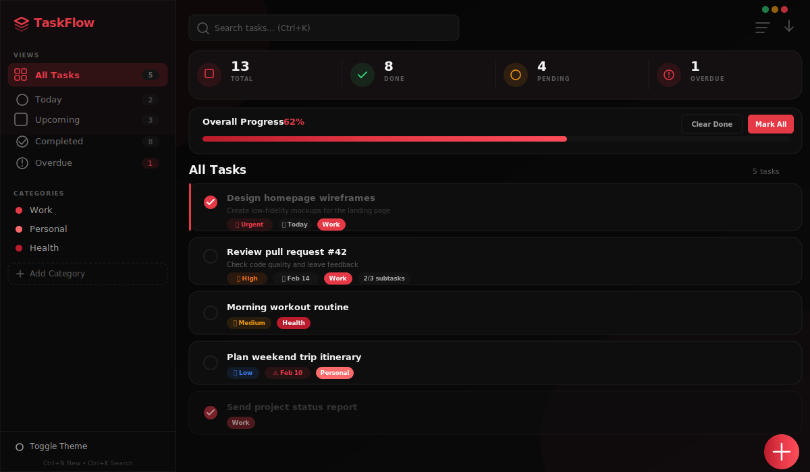

<div align="center">

# 🔴 TaskFlow

### A cinematic task manager with a red & black aesthetic

Built with pure HTML, CSS & JavaScript — no frameworks, no dependencies.

<br>



<br>

**[Live Demo](#getting-started)** · **[Features](#features)** · **[Keyboard Shortcuts](#keyboard-shortcuts)**

---

</div>

## Preview

> A sleek, sidebar-navigated task manager with priorities, due dates, categories, subtasks, and dark/light themes — all wrapped in a striking red & black cinematic design.

## Features

### Core Task Management

| Feature               | Description                                                                              |
| --------------------- | ---------------------------------------------------------------------------------------- |
| **Create & Edit**     | Full modal form with title, description, priority, due date/time, category, and subtasks |
| **Priority Levels**   | None · Low · Medium · High · Urgent — color-coded tags on each task                      |
| **Due Dates & Times** | Set deadlines with smart labels: _Today_, _Tomorrow_, _Overdue_                          |
| **Subtasks**          | Break tasks into steps; parent auto-completes when all subtasks are done                 |
| **Categories**        | Create custom categories with color picker; filter tasks by category                     |
| **Duplicate Tasks**   | One-click task duplication for recurring work                                            |

### Smart Views

| View          | What it shows                      |
| ------------- | ---------------------------------- |
| **All Tasks** | Everything in one place            |
| **Today**     | Tasks due today                    |
| **Upcoming**  | Future tasks                       |
| **Completed** | Finished tasks                     |
| **Overdue**   | Past-due tasks (red badge warning) |
| **Category**  | Filter by any custom category      |

### UI & Experience

- 🎨 **Dark / Light theme** toggle with red & black cinematic design
- 📊 **Stats strip** — total, done, pending, overdue at a glance
- 📈 **Animated progress bar** with glowing red gradient
- 🔍 **Real-time search** across task titles and descriptions
- 🔃 **Sorting** — by date created, due date, priority, or alphabetical
- 📦 **Export to JSON** — download all tasks and categories
- 💾 **Persistent storage** — everything saved to `localStorage`
- 📱 **Fully responsive** — sidebar collapses on mobile with overlay
- ✨ **Smooth animations** — task cards, modals, toasts, FAB rotation
- 🔔 **Toast notifications** — success, error, and info feedback

## Keyboard Shortcuts

| Shortcut   | Action                    |
| ---------- | ------------------------- |
| `Ctrl + N` | Create new task           |
| `Ctrl + K` | Focus search bar          |
| `Escape`   | Close any open modal      |
| `Enter`    | Submit task / add subtask |

## Getting Started

```bash
# Clone the repository
git clone https://github.com/masy43/to-do-list.git

# Open in browser
cd to-do-list
start index.html        # Windows
open index.html         # macOS
xdg-open index.html     # Linux
```

No build tools, no `npm install`, no server required — just open the HTML file.

## Project Structure

```
to-do-list/
├── index.html                # App entry point
├── src/
│   ├── css/
│   │   └── style.css         # Red & black themed CSS with dark/light modes
│   └── js/
│       └── app.js            # Full application logic (state, CRUD, rendering)
├── assets/
│   └── images/
│       ├── preview.svg       # App preview mockup
│       └── Mockup.png        # Design mockup
├── .gitignore                # Git ignore rules
├── LICENSE                   # MIT License
└── README.md                 # This file
```

## Tech Stack

| Technology       | Usage                                                            |
| ---------------- | ---------------------------------------------------------------- |
| **HTML5**        | Semantic structure, accessible forms, SVG icons                  |
| **CSS3**         | Custom properties, flexbox, grid, animations, `backdrop-filter`  |
| **Vanilla JS**   | State management, DOM rendering, `localStorage`, keyboard events |
| **Google Fonts** | Inter typeface (300–800 weights)                                 |

## Customization

The entire color scheme is driven by CSS custom properties. To change the theme:

```css
[data-theme="dark"] {
  --accent: #e63946; /* Primary red */
  --accent-hover: #ff4d5a; /* Hover red */
  --accent-deep: #b91c2c; /* Deep red */
  --bg-primary: #050505; /* Background */
  --bg-card: #0e0e0e; /* Card surfaces */
}
```

## License

MIT — free for personal and commercial use.
